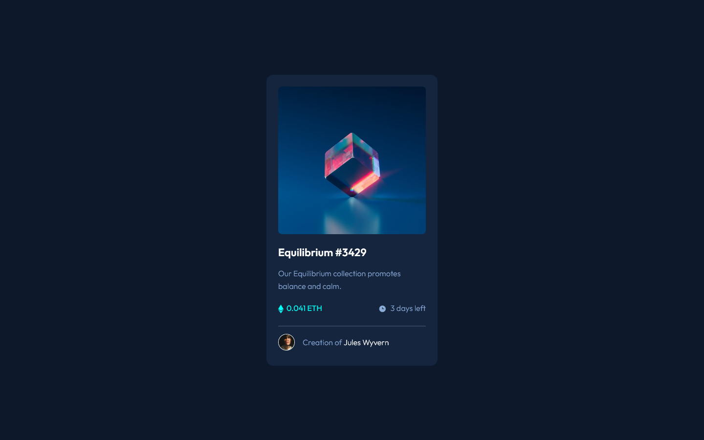

# Frontend Mentor - NFT preview card component solution

This is a solution to the [NFT preview card component challenge on Frontend Mentor](https://www.frontendmentor.io/challenges/nft-preview-card-component-SbdUL_w0U). 

## Table of contents

- [Frontend Mentor - NFT preview card component solution](#frontend-mentor---nft-preview-card-component-solution)
  - [Table of contents](#table-of-contents)
  - [FEM Front Matter](#fem-front-matter)
    - [The challenge](#the-challenge)
    - [Screenshot](#screenshot)
    - [Links](#links)
  - [Plan](#plan)
    - [Goals](#goals)
    - [Time Estimate](#time-estimate)
  - [Review](#review)
    - [Time](#time)
    - [Built with](#built-with)
    - [Challenges](#challenges)
    - [Lessons Learned](#lessons-learned)
    - [Next Steps](#next-steps)
    - [Resources](#resources)
  - [Author](#author)

## FEM Front Matter

### The challenge

Users should be able to:

- View the optimal layout depending on their device's screen size
- See hover states for interactive elements

### Screenshot

### Links

- Solution URL: [Add solution URL here](https://github.com/gnjmonroe/nft-preview-card-component-main)
- Live Site URL: [Add live site URL here](https://gnjmonroe.github.io/nft-preview-card-component-main)

## Plan

### Goals

- Complete the project with reasonable accuracy.
- Estimate and budget time.
- Refresh semantic HTML skills.
- Refresh SCSS skills.
- Practice outlining a project and workflow.

### Time Estimate

- HTML [15']
- CSS (structure) [15']
- CSS (fill-in & fine-tuning) [30']
- CSS (hover states) [15']
- Final Check [30']

Total Estimated Time: [105']

## Review

### Time

- Plan / Outline [28']
- HTML [14']
- CSS (structure) [16']
- CSS (filling-in & fine-tuning) [121']
- CSS (hover states) [21']
- Final Check [19']

Total Actual Time: [219']

### Built with

- Semantic HTML5 markup
- Sass/SCSS
- Flexbox
- Mobile-first workflow
- Adobe XD

### Challenges

- The price-time section
  - Had to look up pseudo-elements and flexbox.
- The image's hover state
  - Had to look up positioning and display attributes.

### Lessons Learned

- Planning and outlining take time and I need to remember to plan for that time.
- The more that I can specifically resolve in the planning/outline stage, the quicker I can finish the project.
- I did a decent job of predicting the time required for the project, outside of the bulk of the CSS work.
- I need to find a way to plan/outline the CSS work (and in the future, JS work) without pseudo-code.

### Next Steps

- Do another project to reinforce the skills used in this project.
- Start thinking about how to explain a project and the decision-making in it (why a certain architecture was chosen, what the priorities are). This is also tied to in-code documentation practices.
- Continue keeping the HTML and CSS neat and readable.

### Resources

- [BEM](http://getbem.com/introduction/) - The official BEM documentation.
- [CSS Reset Documentation](https://piccalil.li/blog/a-modern-css-reset/) - The base for the CSS reset that I use.
- [Sass Guidelines](https://sass-guidelin.es/) - Generally helpful best practices regarding Sass/SCSS and the base folder architecture that I use (the 7-1 pattern)

## Author

- Website - [Gregory Nathan Jinsoo Monroe](https://www.jinsoo.co)